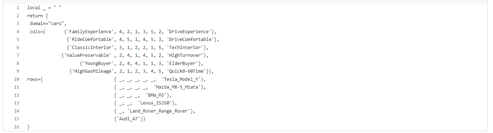
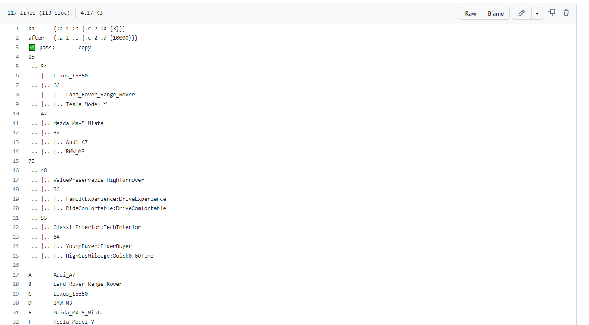
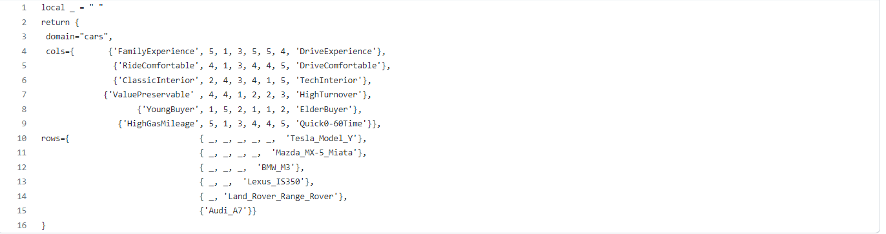
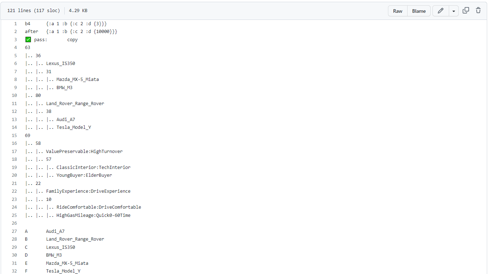
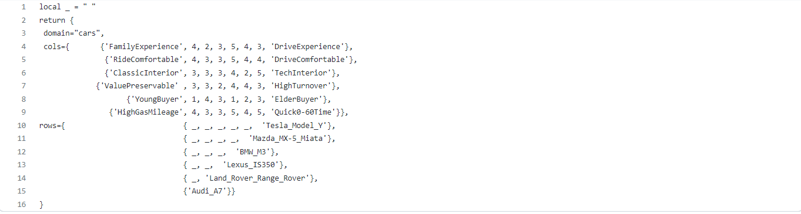
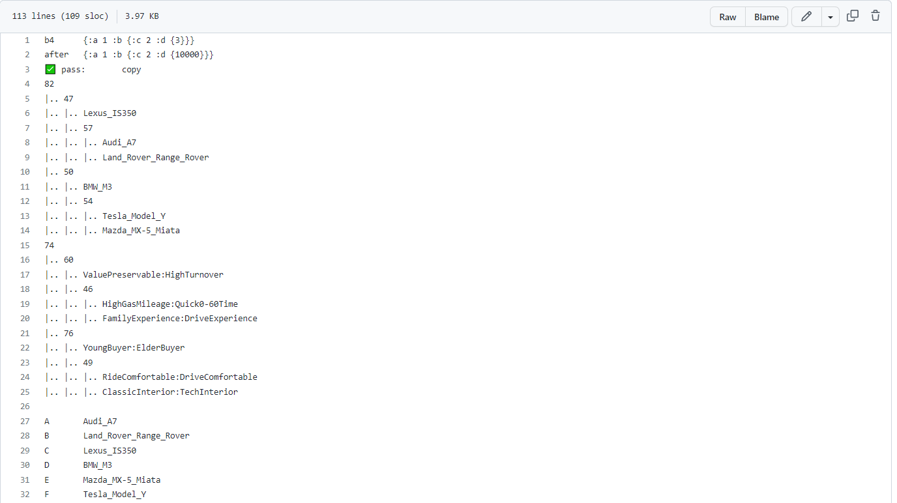

# grid

## This is the README file of HW4-grid (CSC 591, 2023)
Since this work is based on previous HWs, we do not explain details, in order to make it clear enough.

## Result:
* [Expected result](https://github.com/timm/tested/blob/main/etc/out/grid.out):

(the result is too long to have a screen capture)

* [Result](https://github.com/yzhu27/grid/blob/main/etc/out/grid.out):

(same reason)

## Report:

Specifically, there is a small-survey with 3 candidates. The general report is [here](https://github.com/yzhu27/grid/blob/main/repgrid_essay.md):

As for each interviewee, the inputs and reports are here:

Interviewee 1:

* [Questionnaire](https://github.com/yzhu27/grid/blob/main/etc/data/interviewee1.csv)

* [Output](https://github.com/yzhu27/grid/blob/main/etc/out/interviewee1.out)

Interviewee 2:

* [Questionnaire](https://github.com/yzhu27/grid/blob/main/etc/data/interviewee2.csv)

* [Output](https://github.com/yzhu27/grid/blob/main/etc/out/interviewee2.out)

Interviewee 3:

* [Questionnaire](https://github.com/yzhu27/grid/blob/main/etc/data/interviewee3.csv)

* [Output](https://github.com/yzhu27/grid/blob/main/etc/out/interviewee3.out)

## Contributors:
* Jiayuan Huang [jhuang52]
* Mengzhe Wang [mwang39]
* Yuheng Zhu [yzhu63]
