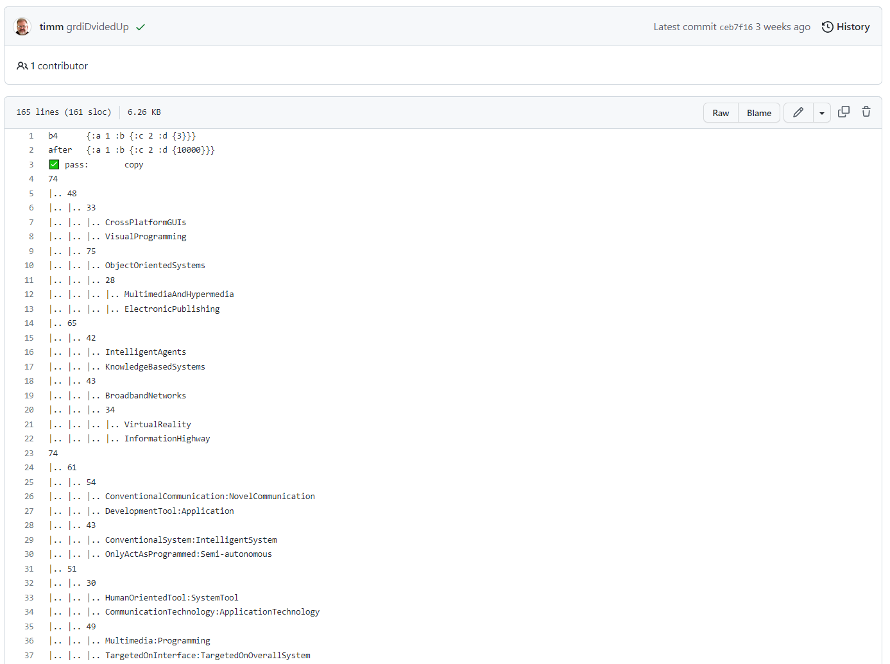
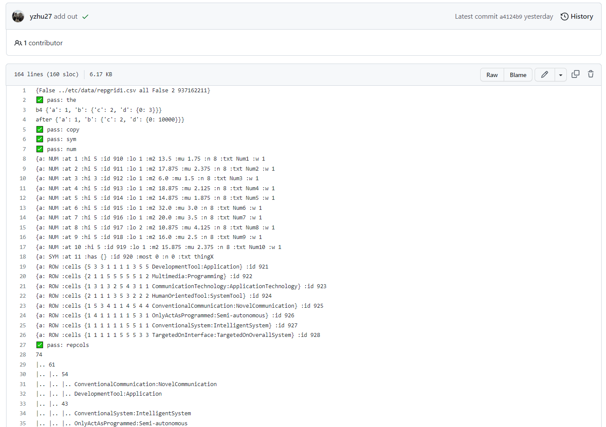

# grid

## This is the README file of HW4-grid (CSC 591, 2023)
Since this work is based on previous HWs, we do not explain details, in order to make it clear enough.

## Result:
* [Expected result](https://github.com/timm/tested/blob/main/etc/out/cluster.out):

* [Result](https://github.com/yzhu27/cluster/blob/main/etc/out/cluster.out):

Specifically, there is a small-survey with 3 candidates. The general result is here:

As for each respondant, the reports are here:

## Contributors:
* Jiayuan Huang [jhuang52]
* Mengzhe Wang [mwang39]
* Yuheng Zhu [yzhu63]
